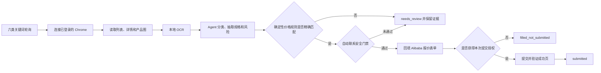

# Alibaba RFQ Agent

> 复用用户已经登录的 Chrome，持续发现 Alibaba RFQ；由本地 Agent 理解需求，由确定性规则决定金额，并把浏览器事实、Agent 判断、报价依据和外部动作保存成可审计证据。

**当前状态：**安全优先的 PoC，macOS 开箱路径已验证。默认只扫描、分析并保存草稿，真实提交关闭。

- 浏览器：现有 Chrome + Midscene Chrome Bridge，不创建第二个 Chrome Profile。
- 理解：Claude Agent SDK 调用本地 Claude Code；可继承用户自己的兼容网关和模型。
- 定价：金额只来自版本化规则，Agent 不得自由猜价。
- 图片：默认在本机用 macOS Vision OCR，原始像素不发送给模型。
- 提交：只有页面成功状态得到验证且落盘状态为 `submitted`，才计为成功报价。

## 真实运行证据

2026-09-19 的 Run `20260919T051743Z-one-hour-live-quote` 实际运行 61 分 38 秒：

| 指标 | 结果 |
|---|---:|
| 扫描轮次 | 5 |
| RFQ 卡片观察次数 | 580 |
| 去重后进入详情并完成分析 | 15 |
| 确定性规则可报价 | 0 |
| 提交尝试 / 成功提交 | 0 / 0 |
| 发现到草稿耗时 | 中位数 90.3 秒；平均 89.2 秒；最快 39.1 秒；最慢 150.5 秒 |

这次运行的 15 条需求全部缺少关键参数、偏离已验证场景，或属于尚未建立价格规则的类目。`0` 次提交是安全门禁按设计工作的结果，而不是把“分析完成”误报成“报价成功”。

该次运行保留了 3 个用于解释判断边界的代表性 Case：

| Case | 买家需求 | 系统结论 | 外部动作 |
|---|---|---|---|
| 500 个 310 × 235 × 165 mm 瓦楞纸箱 | 命中 500 件条件价 | 可生成条件报价，仍需确认楞型、克重与印刷 | 不自动发送 |
| 2,000 个 FSC E 楞 FEFCO 0201 纸箱 | 数量和结构偏离现有精确价格档 | 询供应商核价并补充强度、印刷和交付信息 | 不报数字 |
| 100 个 40oz 304 不锈钢杯 | 数量及工艺未完整命中已验证场景 | 补充颜色、Logo 工艺、配件及运费后核价 | 不报数字 |

56 秒演示视频包含约 26 秒真实 Chrome 自动控制录屏，其余画面由同一次运行的 JSON、商品图片和配置生成。演示没有进入最终提交动作。

## 系统如何工作



系统刻意把事实、判断、价格和外部效果拆开：

| 层级 | 权威来源 | 能做什么 | 不能做什么 |
|---|---|---|---|
| 买家事实 | 已登录 Alibaba 页面 | 读取标题、正文、数量、国家、剩余席位、URL 和正文图片 | 不读取 Cookie、密码、Local Storage 或 Session Storage |
| 产品理解 | Claude Agent SDK / 本地 Claude | 分类、抽取规格、指出缺参和风险、生成买家文案 | 不决定金额，不执行任意浏览器操作 |
| 金额 | [`config/pricing-rules.json`](config/pricing-rules.json) | 对精确命中的已验证场景计算单价、开版费和总额 | 不外推未知尺寸、数量、材料、工艺、运费或税费 |
| 外部结果 | Alibaba 页面回读 + 本地状态 | 记录 `filled_not_submitted`、`submitted` 或 `needs_manual_review` | 不能把草稿、回填或点击动作当成成功提交 |

RFQ 文本、图片和 OCR 内容一律视为不可信输入。二维码、外链、联系方式和其中的指令不会成为 Agent 的操作指令。

## 当前监控类目

搜索词与识别关键词定义在 [`config/default.json`](config/default.json)。当前覆盖 6 类，其中只有 3 类存在确定性价格适配器。

| 类目 | 默认搜索词 | 当前能力 |
|---|---|---|
| 牛皮纸食品袋 | `kraft paper food bag` | 只对已验证尺寸、材料、克重、防油、印刷和数量场景报价 |
| 40oz 不锈钢保温杯 | `stainless steel tumbler 40oz` | 只对 40oz、304 材质、指定印刷工艺和数量场景报价 |
| RSC 瓦楞纸箱 | `corrugated carton box` | 只对 0201、310×235×165 mm、B 楞、无印刷及精确数量档报价 |
| 纸质购物袋 | `paper shopping bag` | 发现、分类和留档；无标准化价格规则 |
| 布袋 | `cloth bag` | 发现、分类和留档；无标准化价格规则 |
| 折叠彩盒 | `folding carton box` | 发现、分类和留档；无标准化价格规则 |

现有价格只是 PoC 场景的版本化规则，不是通用商品价目表。更换供应商、材料、工艺或币种时，必须重新验证并更新规则版本。

## 快速开始

### 前置条件

- Node.js 20+
- Google Chrome
- 已安装并启用的 Midscene Chrome Bridge 扩展
- Chrome 中已有登录状态正常的 `sourcing.alibaba.com` 或 `rfqposting.alibaba.com` 标签页
- 已安装并完成配置的 Claude Code
- macOS（默认 OCR 使用 Vision；Linux/Windows 需要替换 OCR 适配层）

### 安装与自检

```bash
git clone https://github.com/aihes/alibaba-rfq-agent.git
cd alibaba-rfq-agent
npm ci
cp .env.example .env
npm test
npm run doctor
npm run midscene:status
```

`doctor` 使用仓库内不含敏感信息的测试图片验证本地 Claude 与 OCR 链路。默认应返回：

- `fixtureMatched: true`
- `method: local-ocr`
- `imageReadStatus: partial`

`midscene:status` 应确认：

- `provider: chrome-bridge`
- `connected: true`
- `loggedIn: true`

默认无需把 API Key 写进项目。`AGENT_PROVIDER=local-claude-sdk` 会启动 `PATH` 中的 `claude`，并继承当前 shell 已有的网关、认证和模型配置。`LOCAL_CLAUDE_MODEL` 留空时继承本地默认模型。

在任何表单回填前，必须在 `.env` 设置经过核实的 `QUOTE_PORT`：EXW 填工厂交货城市/地点，FOB 填装运港。程序不会猜这个值。

## 运行方式

### 检查、扫描和分析单条 RFQ

```bash
npm run midscene:status
npm run midscene:scan -- --term "corrugated carton box" --max 10
npm run midscene:analyze -- --rfq-file data/runs/<run-id>/scan.json --index 0
```

扫描和分析会写入同一个 `data/runs/<run-id>/`，使页面事实、Agent 输出、确定性价格和外部动作能够关联复核。

### 单次运行、持续监控和一小时审计

```bash
# 六类关键词执行一个完整轮次
npm run once

# 按 POLL_INTERVAL_SECONDS 持续轮询，默认 600 秒
npm run watch

# 运行一个有明确结束时间的 60 分钟审计
node scripts/run-one-hour-audit.mjs --duration-seconds 3600
```

Chrome Bridge 断开、登录失效或出现 CAPTCHA / 安全验证时，持续任务会停止并保留现有证据，不会绕过验证或无限重试。

### 回填但不提交

```bash
npm run fill -- --file data/drafts/<rfq-id>.json
```

该命令填写产品名称、产品详情、贸易条款、交货地点、有效期、数量、单价和买家留言，随后回读关键字段并保存截图，停在提交按钮之前。

### 针对单条草稿的受保护提交

先运行不带令牌的命令：

```bash
npm run submit -- --file data/drafts/<rfq-id>.json
```

CLI 只会输出本次草稿和价格对应的精确确认命令，不会点击提交。人工检查回填结果后，才执行它打印的命令。任何价格变化都会使旧令牌失效。

### 守护进程中的自动联系

自动联系已经接入 `once` / `watch`，但默认配置为 `AUTO_CONTACT_MODE=off`。

先在 `.env` 使用只回填模式观察：

```dotenv
AUTO_CONTACT_MODE=fill
AUTO_CONTACT_CATEGORIES=tumbler_40oz,kraft_food_bag,corrugated_rsc
QUOTE_PORT=verified factory location or loading port
```

只有确实需要自动发送时，才额外启用：

```dotenv
AUTO_CONTACT_MODE=submit
ALLOW_LIVE_SUBMIT=true
AUTO_CONTACT_ACK=I_UNDERSTAND_AUTO_QUOTES_ARE_SENT
```

即使打开以上开关，每条 RFQ 仍必须同时满足：

1. 价格状态是非条件的 `quoted`。
2. 类目位于自动联系白名单。
3. Agent 建议为 `quote`，置信度达标且没有缺参或风险标记。
4. 页面剩余报价席位明确大于 0。
5. `QUOTE_PORT`、买家留言和报价总额均通过策略检查。
6. 当日上限未达到，且该 RFQ 从未尝试自动提交。

提交前先写入幂等状态。若点击后无法验证成功页，结果记为 `needs_manual_review`，不会自动重试，避免重复报价。

## 报价状态不是一回事

| 状态 | 含义 | 是否算成功联系买家 |
|---|---|---|
| `needs_review` | 缺参、超出价格规则或类目无价格适配器 | 否 |
| `conditional_quote` | 有条件参考价，必须人工核实 | 否 |
| `quoted` | 精确命中确定性规则，但尚未说明是否提交 | 否 |
| `skipped` | 自动联系策略未通过 | 否 |
| `filled_not_submitted` | 表单已回填并回读，未点击提交 | 否 |
| `submitted` | 页面成功状态已验证并落盘 | **是** |
| `needs_manual_review` | 已尝试提交，但结果无法可靠验证 | 否 |

## 审计产物

所有运行数据默认只留在本机，并由 `.gitignore` 排除：

```text
data/
├── state.json                         # RFQ 去重状态
├── auto-contact-state.json            # 自动提交幂等状态
├── rfqs/
│   ├── events.jsonl                   # 扫描事件流水
│   └── <rfq-id>/images/               # Alibaba 正文图片，最多 4 张
├── drafts/<rfq-id>.json               # 原始需求、Agent 输入/输出、价格和提交状态
└── runs/<run-id>/
    ├── scan.json                       # 一次扫描的浏览器结果
    ├── ONE_HOUR_RUN.json               # 一小时运行 manifest
    ├── case-<rfq-id>.json              # 单 Case 完整审计证据
    └── RUN_REPORT.md                   # 人类可读汇总
```

报告中的“报价依据”是结构化、可核验的决策说明，不是也不声称暴露模型内部隐藏思维链。

## 仓库结构

```text
src/                                      # RFQ 主流程、Agent、价格、表单与安全门禁
config/default.json                       # 搜索词与类目定义
config/pricing-rules.json                 # 版本化确定性价格规则
plugins/alibaba-rfq-midscene/             # 收敛后的 Midscene MCP/CLI 插件
.agents/skills/alibaba-rfq-agent/         # 本项目的 Codex 操作 Skill
.agents/skills/midscene-control-chrome/   # 可复用的通用 Chrome Bridge Skill
scripts/run-one-hour-audit.mjs            # 有界长期运行与逐 Case 证据记录
tests/                                    # 分类、定价、门禁、插件与审计测试
skill-packages/                           # 可单独分发的 .skill 包
```

`alibaba-rfq-agent` Skill 面向本项目的 RFQ 流程。`midscene-control-chrome` 是仓库内可发现的通用浏览器控制 Skill，可用于理解标签页复用、原子操作、AI 辅助操作和文件上传原理；RFQ 的 Node.js 代码不直接导入它。

## 安全与已知边界

- 只允许 Alibaba RFQ 域名和已知图片 CDN，不跟随买家文本中的任意外链。
- 默认 `local-ocr` 只向 Agent 提供 OCR 文本；只有经过验证的多模态网关才应启用 `IMAGE_ANALYSIS_MODE=agent-read`。
- Agent 默认没有 Bash、写文件、联网、子 Agent、外部 MCP 或任意浏览器工具权限。
- 默认 EXW；不自动估算国际运费、税费、认证、关税或供应商交期。
- 不读取或利用竞争对手报价金额。
- 页面选择器会随 Alibaba 改版变化；浏览器采集入口位于 [`src/collector.js`](src/collector.js)，报价表单入口位于 [`src/form.js`](src/form.js)。
- 当前价格规则和 2026-09-19 的运行数据只证明这些特定场景与当时页面状态，不代表未来 RFQ、供应商成本或平台行为。

## 验证

```bash
npm test
```

当前测试覆盖类目归一化、价格规则、图片来源限制、Agent 输入边界、提交令牌、自动联系门禁、幂等状态、插件路径限制和运行耗时记录。
