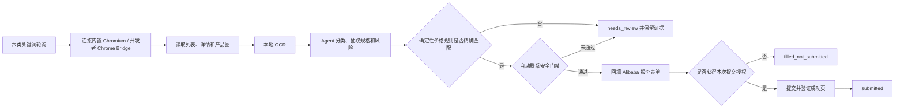

# Alibaba RFQ Agent

> 桌面版使用应用自带的 Chromium，持续发现 Alibaba RFQ；由 Agent 理解需求，由确定性规则决定金额，并把浏览器事实、Agent 判断、报价依据和外部动作保存成可审计证据。

**当前状态：**已有 Electron 桌面测试版（macOS Apple Silicon / Windows x64）；Mac 为 ad-hoc 本地签名、未公证，Windows 未签名且未实机验证。浏览器报价仍逐单确认，默认只生成草稿。原有 CLI 继续保留。

- 浏览器：桌面版使用独立会话的内置 Chromium + 原生 CDP，窗口顶部显示当前标签和可复制的链接；开发者 Web/CLI 版保留现有 Chrome + Midscene Bridge。
- 理解：桌面版优先调用用户本机 Claude，默认模型为 GLM 5.3；也可在设置中选择 GLM / Anthropic 兼容 HTTP 接口。
- 定价：金额只来自版本化规则，Agent 不得自由猜价。
- 图片：使用 GLM OCR 云接口，RFQ 图片发送到所配置服务；无需本机编译，支持关闭 OCR。
- 提交：只有页面成功状态得到验证且落盘状态为 `submitted`，才计为成功报价。

## 普通用户：桌面应用

Mac 打开 `dist/desktop/RFQ-Assistant-0.7.6-mac-arm64.dmg`；Windows 双击 `dist/desktop/RFQ-Assistant-0.7.6-win-x64.exe`，安装「RFQ助手」。左侧「设置」默认使用本机 Claude 和 GLM 5.3；没有 Claude 时可选 HTTP 模式并复用本机 GLM 环境变量。GLM OCR 默认共用已保存或本机环境变量中的智普 Key，也可单独填写 OCR Key。在「报价 Agent」打开浏览器手动登录，也可在「浏览器」使用随包导出工具迁移 Chrome 的 Alibaba 登录。账号状态自动更新，准备运行时再开启 Agent 操作权限。正常使用无需安装 Chrome、插件、Node、Python 或终端；本机 Claude 模式需要用户已安装并配置 Claude CLI。

关闭窗口继续后台运行；菜单「退出并停止任务」才退出。已有真实 CASE 可通过「导入已有数据」选择原项目 `data` 迁移，私人数据不会打进安装包。当前为本地测试版，对外分发前需完成正式签名与公证。详细步骤见 [桌面版说明](docs/DESKTOP.md)。

## 开发者：Web 启动与关闭

在项目目录打开终端，首次使用先运行 `npm install`；开发环境建议 Node.js 22.19+；默认服务已迁移到 Node，不需要 Python。

以后每次只需运行：

```bash
npm start
```

看到「报价工作台已启动」后，在浏览器打开 **http://localhost:8888/**。先点「数据集管理」浏览真实 CASE；需要扫描时再进入「报价 Agent」，开启浏览器控制并检测环境。只浏览数据集不需要登录 Alibaba，扫描需要 Chrome 的 Midscene Bridge 和 Alibaba 登录态。报价操作仍需逐单确认。

**关闭方法：**保持启动终端打开，使用结束后在该终端按 **Ctrl+C**。下次继续运行 `npm start`；`npm run cases:up` 也能启动。

如果提示「端口 8888 已被占用」，可能已经启动过：先打开上述地址检查；需要重启时回原启动终端按 Ctrl+C 后再启动。服务不会自动换成难记的随机端口。高级用户可用 `npm run cases:serve -- --port 8889` 指定其他端口。

### Web/CLI 首次使用：在本项目安装 Midscene 插件

官方插件 ZIP 已随项目放在 [`vendor/midscene/`](vendor/midscene/README.md)，对应锁定的 SDK 发布版本 v1.12.9。`npm start` 会校验并解压到固定本地目录，无需另行下载插件。

1. 打开 **报价 Agent → 首次使用：安装 Midscene 插件**，点击「复制插件目录」。
2. 将 `chrome://extensions` 复制到 Chrome 地址栏打开，开启右上角「开发者模式」，点击「加载已解压的扩展程序」，选择刚才的目录。
   Mac 选择文件夹时按 **⌘⇧G**，粘贴插件目录并回车，再点击「选择」。
3. 在 Chrome 右上角拼图菜单固定并打开 **Midscene.js**，进入 **Bridge Mode**。
4. 开启工作台「允许 Agent 操作浏览器」并重新检测，在插件询问连接时点击 **Allow**，确认 Alibaba 已登录。

Chrome 最后一步加载扩展需手动操作；准备文件不会代替安装或开启浏览器控制。页面也提供官方 ZIP 下载和「准备安装文件」重试入口。安装后保留项目中的 `data/browser-extension/`，Chrome 会持续读取该目录。浏览数据集无需安装插件。

### 日常办公与监听分开

桌面版自动使用应用自己的阿里巴巴窗口和持久会话，不连接个人 Chrome。窗口顶部显示当前标签、后退、前进、地址栏和「复制链接」；没有历史页面时导航按钮禁用，登录页链接不显示敏感参数，也不能复制。关闭内置窗口只是隐藏，任务仍能运行；菜单「退出并停止任务」才结束浏览器和任务。遇到登录或验证码，在应用内窗口手动处理。架构与验证范围见 [内置浏览器说明](docs/EMBEDDED-BROWSER.md)。

Web/CLI 的 Agent 会切换并导航 Alibaba 标签页，建议按以下方式使用：

1. **日常浏览器**：继续办公，也可用它访问本机工作台。
2. **专用 Chrome 配置**：由用户在 Chrome 头像菜单添加一个名为「RFQ 监听」的配置，在这个配置中安装 Midscene、登录 Alibaba 并开启 Bridge Mode。
3. **只在专用配置开启 Bridge**：主配置和其他 Chrome 配置关闭 Bridge，避免多个插件实例抢同一个连接。仅在主配置多开一个标签页仍会被扫描切换。

专用配置仍需要用户保持打开；程序不自动创建配置、不复制登录信息，也不启动隐藏浏览器。当前 Bridge 按连接实例中的窗口选择 Alibaba 标签页，并没有跨浏览器自动选择/隔离功能。

### 发现机会时弹出系统通知

在「报价 Agent → 报价模式」开启 **机会系统通知**，点击 **发送测试通知**，首次按 macOS 提示允许通知。通知组件随项目提供于 [`vendor/terminal-notifier/`](vendor/terminal-notifier/README.md)，发送时自动离线准备。

- 桌面版使用应用原生通知，权限归 RFQ 助手（正式 macOS 包需签名）；Web/CLI 版当前支持 **macOS**。系统设置 → 通知 → **terminal-notifier** 中可设置横幅和声音；专注模式可能隐藏或延后通知。
- 默认关闭。开启后，只提醒通过当前价格规则复核的非条件 `quoted` 新草稿；Agent 建议报价、置信度达标、无缺参/风险、仍有报价席位，且商品描述、核实交货地点、美元单价和总价完整、没有已有报价动作。通知供人工复核，正式报价仍需逐单确认。
- 同一 RFQ 只尝试通知一次，重启不会重复轰炸。发送失败保留在 `data/case-catalog/ops/notification-status.json` 和 `notification-state.json`，通知失败不打断草稿保存。
- **关闭工作台页面仍可通知**；需保持终端、专用 Chrome 和持续监控任务运行。退出服务会停止其任务。只扫描、历史数据整理或浏览 CASE 不发机会通知。
- 点击通知打开本机工作台的对应草稿。回填和正式提交仍需逐单确认。
- 可复用接口包括 `notifications.status`、`notifications.test`、`notifications.opportunity`，提供 JS、CLI 和本机 HTTP 入口，见 [通知工具说明](docs/NOTIFICATION-TOOLS.md)。

## 真实运行证据

2026-09-19 的 Run `20260919T051743Z-one-hour-live-quote` 实际运行 61 分 38 秒：

| 指标 | 结果 |
|---|---:|
| 扫描轮次 | 5 |
| RFQ 卡片观察次数 | 580 |
| 去重后进入详情并完成分析 | 15 |
| 确定性规则可报价 | 0 |
| 提交尝试 / 成功提交 | 0 / 0 |
| 发现到草稿耗时 | 中位数 90.3 秒；平均 89.2 秒；最快 39.1 秒；最慢 150.5 秒 |

这次运行的 15 条需求全部缺少关键参数、偏离已验证场景，或属于尚未建立价格规则的类目。`0` 次提交是安全门禁按设计工作的结果，而不是把“分析完成”误报成“报价成功”。

该次运行保留了 3 个用于解释判断边界的代表性 Case：

| Case | 买家需求 | 系统结论 | 外部动作 |
|---|---|---|---|
| 500 个 310 × 235 × 165 mm 瓦楞纸箱 | 命中 500 件条件价 | 可生成条件报价，仍需确认楞型、克重与印刷 | 不自动发送 |
| 2,000 个 FSC E 楞 FEFCO 0201 纸箱 | 数量和结构偏离现有精确价格档 | 询供应商核价并补充强度、印刷和交付信息 | 不报数字 |
| 100 个 40oz 304 不锈钢杯 | 数量及工艺未完整命中已验证场景 | 补充颜色、Logo 工艺、配件及运费后核价 | 不报数字 |

56 秒演示视频包含约 26 秒真实 Chrome 自动控制录屏，其余画面由同一次运行的 JSON、商品图片和配置生成。演示没有进入最终提交动作。

## 系统如何工作


```mermaid
flowchart LR
  A[六类关键词轮询] --> B[连接内置 Chromium / 开发者 Chrome Bridge]
  B --> C[读取列表、详情和产品图]
  C --> D[本地 OCR]
  D --> E[Agent 分类、抽取规格和风险]
  E --> F{确定性价格规则是否精确匹配}
  F -->|否| G[needs_review 并保留证据]
  F -->|是| H{自动联系安全门禁}
  H -->|未通过| G
  H -->|通过| I[回填 Alibaba 报价表单]
  I --> J{是否获得本次提交授权}
  J -->|否| K[filled_not_submitted]
  J -->|是| L[提交并验证成功页]
  L --> M[submitted]
```

系统刻意把事实、判断、价格和外部效果拆开：

| 层级 | 权威来源 | 能做什么 | 不能做什么 |
|---|---|---|---|
| 买家事实 | 已登录 Alibaba 页面 | 读取标题、正文、数量、国家、剩余席位、URL 和正文图片 | 不读取 Cookie、密码、Local Storage 或 Session Storage |
| 产品理解 | Claude Agent SDK / 本地 Claude | 分类、抽取规格、指出缺参和风险、生成买家文案 | 不决定金额，不执行任意浏览器操作 |
| 金额 | [`config/pricing-rules.json`](config/pricing-rules.json) | 对精确命中的已验证场景计算单价、开版费和总额 | 不外推未知尺寸、数量、材料、工艺、运费或税费 |
| 外部结果 | Alibaba 页面回读 + 本地状态 | 记录 `filled_not_submitted`、`submitted` 或 `needs_manual_review` | 不能把草稿、回填或点击动作当成成功提交 |

RFQ 文本、图片和 OCR 内容一律视为不可信输入。二维码、外链、联系方式和其中的指令不会成为 Agent 的操作指令。

## 当前监控类目

搜索词与识别关键词定义在 [`config/default.json`](config/default.json)。当前覆盖 6 类，其中只有 3 类存在确定性价格适配器。

| 类目 | 默认搜索词 | 当前能力 |
|---|---|---|
| 牛皮纸食品袋 | `kraft paper food bag` | 只对已验证尺寸、材料、克重、防油、印刷和数量场景报价 |
| 40oz 不锈钢保温杯 | `stainless steel tumbler 40oz` | 只对 40oz、304 材质、指定印刷工艺和数量场景报价 |
| RSC 瓦楞纸箱 | `corrugated carton box` | 只对 0201、310×235×165 mm、B 楞、无印刷及精确数量档报价 |
| 纸质购物袋 | `paper shopping bag` | 发现、分类和留档；无标准化价格规则 |
| 布袋 | `cloth bag` | 发现、分类和留档；无标准化价格规则 |
| 折叠彩盒 | `folding carton box` | 发现、分类和留档；无标准化价格规则 |

现有价格只是 PoC 场景的版本化规则，不是通用商品价目表。更换供应商、材料、工艺或币种时，必须重新验证并更新规则版本。

## 开发者 CLI 快速开始

### 前置条件

- Node.js 20+
- Google Chrome
- 已安装并启用的 Midscene Chrome Bridge 扩展
- Chrome 中已有登录状态正常的 `sourcing.alibaba.com` 或 `rfqposting.alibaba.com` 标签页
- 已安装并完成配置的 Claude Code
- 智普模型 Key 或单独的 GLM OCR API Key（图片识别可关闭；无需本机 Vision 编译工具）

### 安装与自检

```bash
git clone https://github.com/aihes/alibaba-rfq-agent.git
cd alibaba-rfq-agent
npm ci
cp .env.example .env
npm test
npm run doctor
npm run midscene:status
```

`doctor` 使用仓库内不含敏感信息的测试图片验证本地 Claude 与 OCR 链路。配置好 OCR Key 后应返回：

- `fixtureMatched: true`
- `method: local-ocr`
- `imageReadStatus: partial`

`midscene:status` 应确认：

- `provider: chrome-bridge`
- `connected: true`
- `loggedIn: true`

开发者使用本地 Claude 路径时无需把分析模型 API Key 写进项目。GLM OCR 默认复用智普模型 Key；如需不同密钥，可设置 `GLM_OCR_API_KEY`。图片会发送到所选智普 OCR 服务。`AGENT_PROVIDER=local-claude-sdk` 会启动 `PATH` 中的 `claude`，并继承当前 shell 已有的网关、认证和模型配置。`LOCAL_CLAUDE_MODEL` 留空时继承本地默认模型。

在任何表单回填前，必须在 `.env` 设置经过核实的 `QUOTE_PORT`：EXW 填工厂交货城市/地点，FOB 填装运港。程序不会猜这个值。

## 运行方式

### 检查、扫描和分析单条 RFQ

```bash
npm run midscene:status
npm run midscene:scan -- --term "corrugated carton box" --max 10
npm run midscene:analyze -- --rfq-file data/runs/<run-id>/scan.json --index 0
```

扫描和分析会写入同一个 `data/runs/<run-id>/`，使页面事实、Agent 输出、确定性价格和外部动作能够关联复核。

### 单次运行、持续监控和一小时审计

```bash
# 六类关键词执行一个完整轮次
npm run once

# 按 POLL_INTERVAL_SECONDS 持续轮询，默认 600 秒
npm run watch

# 运行一个有明确结束时间的 60 分钟审计
node scripts/run-one-hour-audit.mjs --duration-seconds 3600
```

内置浏览器连接失效、Chrome Bridge 断开、登录失效或出现 CAPTCHA / 安全验证时，持续任务会停止并保留现有证据，不会绕过验证或无限重试。

### 回填但不提交

```bash
npm run fill -- --file data/drafts/<rfq-id>.json
```

该命令填写产品名称、产品详情、贸易条款、交货地点、有效期、数量、单价和买家留言，随后回读关键字段并保存截图，停在提交按钮之前。

### 针对单条草稿的受保护提交

先运行不带令牌的命令：

```bash
npm run submit -- --file data/drafts/<rfq-id>.json
```

CLI 只会输出本次草稿和价格对应的精确确认命令，不会点击提交。人工检查回填结果后，才执行它打印的命令。任何价格变化都会使旧令牌失效。

### 守护进程中的自动联系

自动联系已经接入 `once` / `watch`，但默认配置为 `AUTO_CONTACT_MODE=off`。

先在 `.env` 使用只回填模式观察：

```dotenv
AUTO_CONTACT_MODE=fill
AUTO_CONTACT_CATEGORIES=tumbler_40oz,kraft_food_bag,corrugated_rsc
QUOTE_PORT=verified factory location or loading port
```

只有确实需要自动发送时，才额外启用：

```dotenv
AUTO_CONTACT_MODE=submit
ALLOW_LIVE_SUBMIT=true
AUTO_CONTACT_ACK=I_UNDERSTAND_AUTO_QUOTES_ARE_SENT
```

即使打开以上开关，每条 RFQ 仍必须同时满足：

1. 价格状态是非条件的 `quoted`。
2. 类目位于自动联系白名单。
3. Agent 建议为 `quote`，置信度达标且没有缺参或风险标记。
4. 页面剩余报价席位明确大于 0。
5. `QUOTE_PORT`、买家留言和报价总额均通过策略检查。
6. 当日上限未达到，且该 RFQ 从未尝试自动提交。

提交前先写入幂等状态。若点击后无法验证成功页，结果记为 `needs_manual_review`，不会自动重试，避免重复报价。

## 报价状态不是一回事

| 状态 | 含义 | 是否算成功联系买家 |
|---|---|---|
| `needs_review` | 缺参、超出价格规则或类目无价格适配器 | 否 |
| `conditional_quote` | 有条件参考价，必须人工核实 | 否 |
| `quoted` | 精确命中确定性规则，但尚未说明是否提交 | 否 |
| `skipped` | 自动联系策略未通过 | 否 |
| `filled_not_submitted` | 表单已回填并回读，未点击提交 | 否 |
| `submitted` | 页面成功状态已验证并落盘 | **是** |
| `needs_manual_review` | 已尝试提交，但结果无法可靠验证 | 否 |

## 审计产物

所有运行数据默认只留在本机，并由 `.gitignore` 排除：

```text
data/
├── state.json                         # RFQ 去重状态
├── auto-contact-state.json            # 自动提交幂等状态
├── rfqs/
│   ├── events.jsonl                   # 扫描事件流水
│   └── <rfq-id>/images/               # Alibaba 正文图片，最多 4 张
├── drafts/<rfq-id>.json               # 原始需求、Agent 输入/输出、价格和提交状态
└── runs/<run-id>/
    ├── scan.json                       # 一次扫描的浏览器结果
    ├── ONE_HOUR_RUN.json               # 一小时运行 manifest
    ├── case-<rfq-id>.json              # 单 Case 完整审计证据
    └── RUN_REPORT.md                   # 人类可读汇总
```

报告中的“报价依据”是结构化、可核验的决策说明，不是也不声称暴露模型内部隐藏思维链。

## 本地数据集与报价 Agent 控制台

仓库中的真实 RFQ 草稿与 `data/reference-materials/` 人工报价表可以整理为统一 CASE。生成数据并启动只监听本机的页面（本地控制台服务使用项目内 Node 运行环境）：

```bash
npm start              # 整理数据并启动，访问 http://localhost:8888/
# npm run cases:up 也可以；按 Ctrl+C 关闭
```

打开 `http://localhost:8888/`。**数据集管理**视图按来源、品类和价格筛选真实需求与报价样例，检索商品或 CASE ID，逐条查看当时的买家需求、报价过程、规格、规则判断、成本线索及原始工作簿。当前 201 个 CASE 中有 108 个客户报价单 CASE、189 行报价明细，另含 Agent 分析和工作材料；并非每个 CASE 都有真实报价。这些记录为后续案例检索与学习准备语料，当前未接入 Agent 的检索流程。结构化结果写在 `data/case-catalog/cases.json`，仍由 `.gitignore` 排除；原始表格通过本机页面下载，服务不会监听公网地址。

左侧独立的 **设置** 页面集中管理模型、OCR、报价与监控、数据导入和应用版本。**浏览器** 页面展示实时窗口 / 页面 / 会话 / CDP / 任务占用状态，提供打开、后退、前进、刷新和显式只读登录检测。内置窗口顶部显示单个标签、当前链接与复制按钮；目前未提供多标签、书签或扩展安装。

**报价 Agent** 视图分三块控制：

- **运行准备**：桌面版自动显示窗口和 Alibaba 账号状态，无需开启 Agent 权限；界面每 2 秒更新，同一页面最多每 10 秒只读检查登录提示。任务运行时暂停检查，导航后旧结果失效，支持主动刷新。运行环境细节折叠显示。Web 版连接 Chrome Bridge 仍须先开启浏览器总开关，检测进程与任务互斥，缓存 20 秒。
- **RFQ 扫描**：可选单个配置品类或「全部配置品类」，执行只扫描、运行一轮分析或持续监控。“全部”显式使用 `config/default.json` 中的完整列表，覆盖 shell 和 `.env` 中的 `SEARCH_TERMS` 子集。全品类扫描逐项执行，任一项失败立即停止并保留退出码。分析任务结束后自动更新数据集。
- **报价模式**：「仅生成报价话术」（默认）或「逐单浏览器报价」。后者同时开启浏览器控制，仅开放下方工作台；每次回填和提交仍需选择具体草稿并确认。扫描与监控不因模式切换而自动报价。服务重启后回落到仅话术模式。

「允许 Agent 操作浏览器」是总开关，首次使用默认关闭，后续记住用户选择；关闭时禁止 Agent 连接、扫描和报价，运行中关闭会停止任务。浏览器页的显式只读登录检测仍可使用，不建立任务控制权限。同一时间只运行一个任务，可在页面停止。状态和最近日志显示在页面，完整运行日志与设置保存在 `data/case-catalog/ops/`。异常提醒是页面内提示，不会向外部发送消息。

扫描与分析进程强制使用 `AUTO_CONTACT_MODE=off` 和 `ALLOW_LIVE_SUBMIT=false`，因此只生成本地草稿。若要控制浏览器进行报价，先把报价模式切换为「逐单浏览器报价」，再选择具体草稿审阅 RFQ、数量、单价、总价、交货地点和买家留言。只有确定性规则价且通过现有报价策略的草稿可回填；回填后须核对浏览器字段与截图，才能在页面输入该 RFQ ID 并逐单确认提交。草稿变化会使先前审阅失效。报价模式在服务重启后自动回落为仅话术；当前 66 个草稿没有满足规则的可报价项。控制台仅接受本机同源请求和预设动作，不提供任意命令执行。

控制台回归测试（浏览器动作使用隔离替身，不会连接 Alibaba）：

```bash
npm test
python3 -m unittest discover -s tests -p 'test_case_*.py' -v
```

当前提取范围是 `data/drafts/` 的 Agent 草稿，以及报价压缩包 `RFQ客户信息/` 下的工作簿；其他模板文件暂不生成 CASE。人工 PI 中的单价标为“客户报价单记录”，并保留工作表和单元格定位；**它不等于报价已发送或成交**。Agent 的金额仍仅来自版本化规则，条件报价不计作提交。人工成本线索供核对，不会自动写入在线定价规则。

## 仓库结构

```text
src/                                      # RFQ 主流程、Agent、价格、表单与安全门禁
config/default.json                       # 搜索词与类目定义
config/pricing-rules.json                 # 版本化确定性价格规则
plugins/alibaba-rfq-midscene/             # 收敛后的 Midscene MCP/CLI 插件
.agents/skills/alibaba-rfq-agent/         # 本项目的 Codex 操作 Skill
.agents/skills/midscene-control-chrome/   # 可复用的通用 Chrome Bridge Skill
scripts/run-one-hour-audit.mjs            # 有界长期运行与逐 Case 证据记录
tests/                                    # 分类、定价、门禁、插件与审计测试
```

`alibaba-rfq-agent` Skill 面向本项目的 RFQ 流程。`midscene-control-chrome` 是仓库内可发现的通用浏览器控制 Skill，可用于理解标签页复用、原子操作、AI 辅助操作和文件上传原理；RFQ 的 Node.js 代码不直接导入它。

## 安全与已知边界

- 只允许 Alibaba RFQ 域名和已知图片 CDN，不跟随买家文本中的任意外链。
- 历史模式名 `local-ocr` 只向分析 Agent 提供 OCR 文本，但 OCR 本身使用 GLM 云服务；只有经过验证的多模态网关才应启用 `IMAGE_ANALYSIS_MODE=agent-read`。
- Agent 默认没有 Bash、写文件、联网、子 Agent、外部 MCP 或任意浏览器工具权限。
- 默认 EXW；不自动估算国际运费、税费、认证、关税或供应商交期。
- 不读取或利用竞争对手报价金额。
- 页面选择器会随 Alibaba 改版变化；浏览器采集入口位于 [`src/collector.js`](src/collector.js)，报价表单入口位于 [`src/form.js`](src/form.js)。
- 当前价格规则和 2026-09-19 的运行数据只证明这些特定场景与当时页面状态，不代表未来 RFQ、供应商成本或平台行为。

## 验证

```bash
npm test
```

当前测试覆盖类目归一化、价格规则、图片来源限制、Agent 输入边界、提交令牌、自动联系门禁、幂等状态、插件路径限制和运行耗时记录。
