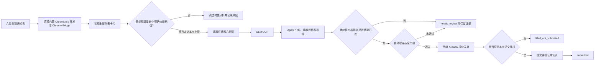

# Alibaba RFQ Agent

> 桌面版使用应用自带的 Chromium，持续发现 Alibaba RFQ；由 Agent 理解需求，金额来自匹配的已批准价格规则或为这条 RFQ 核实的当前售价，并把浏览器事实、Agent 判断、报价依据和外部动作保存成可审计证据。

**当前状态：**已有 Electron 桌面测试版（macOS Apple Silicon / Windows x64）；Mac 为 ad-hoc 本地签名、未公证，Windows 未签名且未实机验证。浏览器报价仍逐单确认，默认只生成草稿。原有 CLI 继续保留。

## 从哪里看代码

应用源码集中在 [`src/`](src/README.md)：`src/desktop/main.js` 是 Electron 入口，`src/desktop/server.js` 提供本机工作台接口，`src/desktop/console.js` 启动和管理任务；`src/frontend/` 是工作台页面源码，`src/prompts/` 是模型提示词与占位符。RFQ 主流程从 `src/pipeline.js` 开始，列表采集在 `src/collector.js`，确定性报价在 `src/pricing.js`。桌面、Web 和 CLI 共用这套业务逻辑。

根目录保留 `config/`（可审阅的默认与定价规则）、`plugins/` 和 `vendor/`（浏览器集成及随包第三方资源）、`scripts/`（构建与维护入口）、`tests/`、`docs/`。`data/` 和 `log/` 保存本机运行结果，`dist/` 和 `build/` 是构建输出；修改功能从 `src/` 入手。

- 浏览器：桌面版使用独立会话的内置 Chromium + 原生 CDP，窗口顶部显示当前标签和可复制的链接；开发者 Web/CLI 版保留现有 Chrome + Midscene Bridge。
- 理解：桌面版默认调用 `glm.knowflow.work` 上的 Claude Code；文字使用 GLM-5.3，带图使用 GLM-5.3-Flash。服务令牌在本机加密保存；本机 Claude 和 GLM / Anthropic 兼容 HTTP 仍可手动选择。
- 定价：金额只来自版本化规则或针对该 RFQ 核实的当前售价，Agent 不得自由猜价。模型分析前先按列表品类、数量筛掉无法形成明确报价的需求；跳过的需求仍在扫描结果中，且不会调用付费 OCR 或模型。
- 图片：默认通过同一云端服务调用 OCR，并将前两张图片直接交给云端 Claude Code 分析；可切换 GLM OCR 直连或关闭 OCR。
- 提交：只有页面成功状态得到验证且落盘状态为 `submitted`，才计为成功报价。

## 普通用户：桌面应用

首次安装和操作请看 [快速使用手册](docs/用户使用手册.md)。

Mac 打开 `dist/desktop/RFQ-Assistant-0.7.21-mac-arm64.dmg`；Windows 双击 `dist/desktop/RFQ-Assistant-0.7.21-win-x64.exe`，安装「RFQ助手」。左侧「设置」默认选择云端 Claude Code 和云端 OCR；填入单独签发的服务授权令牌并保存后，分别点击「测试模型」「测试 OCR」。令牌保存在本机系统加密设置里，不随安装包分发。也可手动选择本机 Claude 或 GLM HTTP。RFQ 扫描按钮置灰时，悬停或聚焦按钮可查看原因与处理办法。在「报价 Agent」打开浏览器手动登录，也可在「浏览器」使用随包导出工具迁移 Chrome 的 Alibaba 登录。账号状态自动更新；桌面版浏览器操作默认可用，登录后直接启动扫描，报价仍需逐单确认。正常使用无需安装 Chrome、Claude、插件、Node 或 Python。

设置页现提供「安装并配置本机 Claude」入口：用户确认后运行官方安装程序，并在系统终端选择智谱平台、输入自己的 Key。脚本保留并备份其他 Claude 设置；Key 会以明文保存在 Claude 用户设置中（macOS 文件权限为 0600，Windows 由用户目录访问权限保护）。安装完需重新读取环境并测试模型连接。希望避免修改 Claude 全局设置时可使用应用内加密保存 Key 的 HTTP 模式。

关闭窗口继续后台运行；菜单「退出并停止任务」才退出。已有真实 CASE 可通过「导入已有数据」选择原项目 `data` 迁移，私人数据不会打进安装包。当前为本地测试版，对外分发前需完成正式签名与公证。详细步骤见 [桌面版说明](docs/DESKTOP.md)。

## 开发者：Web 启动与关闭

在项目目录打开终端，首次使用先运行 `npm install`；开发环境建议 Node.js 22.19+；默认服务已迁移到 Node，不需要 Python。

以后每次只需运行：

```bash
npm start
```

看到「报价工作台已启动」后，在浏览器打开 **http://localhost:8888/**。先点「数据集管理」浏览真实 CASE；需要扫描时再进入「报价 Agent」检测环境。只浏览数据集不需要登录 Alibaba，扫描需要 Chrome 的 Midscene Bridge 和 Alibaba 登录态。报价操作仍需逐单确认。

**关闭方法：**保持启动终端打开，使用结束后在该终端按 **Ctrl+C**。下次继续运行 `npm start`；`npm run cases:up` 也能启动。

如果提示「端口 8888 已被占用」，可能已经启动过：先打开上述地址检查；需要重启时回原启动终端按 Ctrl+C 后再启动。服务不会自动换成难记的随机端口。高级用户可用 `npm run cases:serve -- --port 8889` 指定其他端口。

### Web/CLI 首次使用：在本项目安装 Midscene 插件

官方插件 ZIP 已随项目放在 [`vendor/midscene/`](vendor/midscene/README.md)，对应锁定的 SDK 发布版本 v1.12.9。`npm start` 会校验并解压到固定本地目录，无需另行下载插件。

1. 打开 **报价 Agent → 首次使用：安装 Midscene 插件**，点击「复制插件目录」。
2. 将 `chrome://extensions` 复制到 Chrome 地址栏打开，开启右上角「开发者模式」，点击「加载已解压的扩展程序」，选择刚才的目录。
   Mac 选择文件夹时按 **⌘⇧G**，粘贴插件目录并回车，再点击「选择」。
3. 在 Chrome 右上角拼图菜单固定并打开 **Midscene.js**，进入 **Bridge Mode**。
4. 返回工作台重新检测，在插件询问连接时点击 **Allow**，确认 Alibaba 已登录。

Chrome 最后一步加载扩展需手动操作；准备文件不会代替安装或启动扫描任务。页面也提供官方 ZIP 下载和「准备安装文件」重试入口。安装后保留项目中的 `data/browser-extension/`，Chrome 会持续读取该目录。浏览数据集无需安装插件。

### 日常办公与监听分开

桌面版自动使用应用自己的阿里巴巴窗口和持久会话，不连接个人 Chrome。窗口顶部显示当前标签、后退、前进、地址栏和「复制链接」；没有历史页面时导航按钮禁用，登录页链接不显示敏感参数，也不能复制。关闭内置窗口只是隐藏，任务仍能运行；菜单「退出并停止任务」才结束浏览器和任务。遇到登录或验证码，在应用内窗口手动处理。架构与验证范围见 [内置浏览器说明](docs/EMBEDDED-BROWSER.md)。

Web/CLI 的 Agent 会切换并导航 Alibaba 标签页，建议按以下方式使用：

1. **日常浏览器**：继续办公，也可用它访问本机工作台。
2. **专用 Chrome 配置**：由用户在 Chrome 头像菜单添加一个名为「RFQ 监听」的配置，在这个配置中安装 Midscene、登录 Alibaba 并开启 Bridge Mode。
3. **只在专用配置开启 Bridge**：主配置和其他 Chrome 配置关闭 Bridge，避免多个插件实例抢同一个连接。仅在主配置多开一个标签页仍会被扫描切换。

专用配置仍需要用户保持打开；程序不自动创建配置、不复制登录信息，也不启动隐藏浏览器。当前 Bridge 按连接实例中的窗口选择 Alibaba 标签页，并没有跨浏览器自动选择/隔离功能。

### 发现机会时弹出系统通知

在「报价 Agent → 报价模式」开启 **机会通知**，点击 **发送测试通知**。桌面版会立即显示应用内测试提醒；如需系统横幅，请在系统设置中允许 RFQ 助手通知。Web/CLI 版的 macOS 通知组件随项目提供于 [`vendor/terminal-notifier/`](vendor/terminal-notifier/README.md)，发送时自动离线准备。

- 桌面版同时使用应用内弹出提醒和 Electron 原生系统通知；Web/CLI 版的系统通知当前支持 **macOS**。系统横幅还取决于通知权限和专注模式。桌面版在「报价 Agent → 最近提醒」保留记录，可打开对应草稿。
- 默认关闭。开启后，只提醒通过当前价格规则复核的非条件 `quoted` 新草稿；Agent 建议报价、置信度达标、无缺参/风险、仍有报价席位，且商品描述、核实交货地点、美元单价和总价完整、没有已有报价动作。通知供人工复核，正式报价仍需逐单确认。
- 同一 RFQ 只尝试通知一次，重启不会重复轰炸。发送失败保留在 `data/case-catalog/ops/notification-status.json` 和 `notification-state.json`；即使系统横幅未出现，应用内仍显示提醒与历史记录，通知失败不打断草稿保存。
- **关闭工作台页面仍可通知**；需保持终端、专用 Chrome 和持续监控任务运行。退出服务会停止其任务。只扫描、历史数据整理或浏览 CASE 不发机会通知。
- 点击通知打开本机工作台的对应草稿。回填和正式提交仍需逐单确认。
- 可复用接口包括 `notifications.status`、`notifications.test`、`notifications.opportunity`，提供 JS、CLI 和本机 HTTP 入口，见 [通知工具说明](docs/NOTIFICATION-TOOLS.md)。

## 真实运行证据

2026-09-19 的 Run `20260919T051743Z-one-hour-live-quote` 实际运行 61 分 38 秒：

| 指标 | 结果 |
|---|---:|
| 扫描轮次 | 5 |
| RFQ 卡片观察次数 | 580 |
| 去重后进入详情并完成分析 | 15 |
| 确定性规则可报价 | 0 |
| 提交尝试 / 成功提交 | 0 / 0 |
| 发现到草稿耗时 | 中位数 90.3 秒；平均 89.2 秒；最快 39.1 秒；最慢 150.5 秒 |

这次运行的 15 条需求全部缺少关键参数、偏离已验证场景，或属于尚未建立价格规则的类目。`0` 次提交是安全门禁按设计工作的结果，而不是把“分析完成”误报成“报价成功”。

该次运行保留了 3 个用于解释判断边界的代表性 Case：

| Case | 买家需求 | 系统结论 | 外部动作 |
|---|---|---|---|
| 500 个 310 × 235 × 165 mm 瓦楞纸箱 | 命中 500 件条件价 | 可生成条件报价，仍需确认楞型、克重与印刷 | 不自动发送 |
| 2,000 个 FSC E 楞 FEFCO 0201 纸箱 | 数量和结构偏离现有精确价格档 | 询供应商核价并补充强度、印刷和交付信息 | 不报数字 |
| 100 个 40oz 304 不锈钢杯 | 数量及工艺未完整命中已验证场景 | 补充颜色、Logo 工艺、配件及运费后核价 | 不报数字 |

56 秒演示视频包含约 26 秒真实 Chrome 自动控制录屏，其余画面由同一次运行的 JSON、商品图片和配置生成。演示没有进入最终提交动作。

## 系统如何工作

「运行一轮分析」和「持续监控」每次启动共用最多 3 条需求的分析上限；持续监控后续轮次不会重置。任务状态显示跳过原因、模型/OCR 请求次数和服务实际返回的 token/费用；HTTP 或 OCR 服务没有返回费用时显示“未提供”，不能当成账单。当前内置价格规则只覆盖少数 PoC 数量和规格；没有适用价格时，0 次付费分析和 0 条明确报价是预期结果。要扩大明确报价范围，须先核实并录入当前售价与适用规格。


```mermaid
flowchart LR
  A[六类关键词轮询] --> B[连接内置 Chromium / 开发者 Chrome Bridge]
  B --> C[读取全部列表卡片]
  C --> P{品类和数量命中明确价格档位?}
  P -->|否| S[跳过付费分析并记录原因]
  P -->|是且未达本次上限| Q[读取详情和产品图]
  Q --> D[GLM OCR]
  D --> E[Agent 分类、抽取规格和风险]
  E --> F{确定性价格规则是否精确匹配}
  F -->|否| G[needs_review 并保留证据]
  F -->|是| H{自动联系安全门禁}
  H -->|未通过| G
  H -->|通过| I[回填 Alibaba 报价表单]
  I --> J{是否获得本次提交授权}
  J -->|否| K[filled_not_submitted]
  J -->|是| L[提交并验证成功页]
  L --> M[submitted]
```

系统刻意把事实、判断、价格和外部效果拆开：

| 层级 | 权威来源 | 能做什么 | 不能做什么 |
|---|---|---|---|
| 买家事实 | 已登录 Alibaba 页面 | 读取标题、正文、数量、国家、剩余席位、URL 和正文图片 | 不读取 Cookie、密码、Local Storage 或 Session Storage |
| 产品理解 | Claude Agent SDK / 本地 Claude | 分类、抽取规格、指出缺参和风险、生成买家文案 | 不决定金额，不执行任意浏览器操作 |
| 金额 | [`config/pricing-rules.json`](config/pricing-rules.json) | 对精确命中的已验证场景计算单价、开版费和总额 | 不外推未知尺寸、数量、材料、工艺、运费或税费 |
| 外部结果 | Alibaba 页面回读 + 本地状态 | 记录 `filled_not_submitted`、`submitted` 或 `needs_manual_review` | 不能把草稿、回填或点击动作当成成功提交 |

RFQ 文本、图片和 OCR 内容一律视为不可信输入。二维码、外链、联系方式和其中的指令不会成为 Agent 的操作指令。

## 当前监控类目

搜索词与识别关键词定义在 [`config/default.json`](config/default.json)。当前覆盖 6 类，其中只有 3 类存在确定性价格适配器。

| 类目 | 默认搜索词 | 当前能力 |
|---|---|---|
| 牛皮纸食品袋 | `kraft paper food bag` | 只对已验证尺寸、材料、克重、防油、印刷和数量场景报价 |
| 40oz 不锈钢保温杯 | `stainless steel tumbler 40oz` | 只对 40oz、304 材质、指定印刷工艺和数量场景报价 |
| RSC 瓦楞纸箱 | `corrugated carton box` | 只对 0201、310×235×165 mm、B 楞、无印刷及精确数量档报价 |
| 纸质购物袋 | `paper shopping bag` | 发现、分类和留档；无标准化价格规则 |
| 布袋 | `cloth bag` | 发现、分类和留档；无标准化价格规则 |
| 折叠彩盒 | `folding carton box` | 发现、分类和留档；无标准化价格规则 |

现有价格只是 PoC 场景的版本化规则，不是通用商品价目表。更换供应商、材料、工艺或币种时，必须重新验证并更新规则版本。

## 开发者 CLI 快速开始

### 前置条件

- Node.js 20+
- Google Chrome
- 已安装并启用的 Midscene Chrome Bridge 扩展
- Chrome 中已有登录状态正常的 `sourcing.alibaba.com` 或 `rfqposting.alibaba.com` 标签页
- 已安装并完成配置的 Claude Code
- 智普模型 Key 或单独的 GLM OCR API Key（图片识别可关闭；无需本机 Vision 编译工具）

### 安装与自检

```bash
git clone https://github.com/aihes/alibaba-rfq-agent.git
cd alibaba-rfq-agent
npm ci
cp .env.example .env
npm test
npm run doctor
npm run midscene:status
```

`doctor` 使用仓库内不含敏感信息的测试图片验证本地 Claude 与 OCR 链路。配置好 OCR Key 后应返回：

- `fixtureMatched: true`
- `method: local-ocr`
- `imageReadStatus: partial`

`midscene:status` 应确认：

- `provider: chrome-bridge`
- `connected: true`
- `loggedIn: true`

开发者使用本地 Claude 路径时无需把分析模型 API Key 写进项目。GLM OCR 默认复用智普模型 Key；如需不同密钥，可设置 `GLM_OCR_API_KEY`。图片会发送到所选智普 OCR 服务。`AGENT_PROVIDER=local-claude-sdk` 会启动 `PATH` 中的 `claude`，并继承当前 shell 已有的网关、认证和模型配置。`LOCAL_CLAUDE_MODEL` 留空时继承本地默认模型。

在任何表单回填前，必须在 `.env` 设置经过核实的 `QUOTE_PORT`：EXW 填工厂交货城市/地点，FOB 填装运港。程序不会猜这个值。

## 运行方式

### 检查、扫描和分析单条 RFQ

```bash
npm run midscene:status
npm run midscene:scan -- --term "corrugated carton box" --recent-minutes 60
npm run midscene:analyze -- --rfq-file data/runs/<run-id>/scan.json --index 0
```

扫描和分析会写入同一个 `data/runs/<run-id>/`，使页面事实、Agent 输出、确定性价格和外部动作能够关联复核。

### 单次运行、持续监控和一小时审计

```bash
# 六类关键词执行一个完整轮次
npm run once

# 按 POLL_INTERVAL_SECONDS 持续轮询，默认 600 秒
npm run watch

# 运行一个有明确结束时间的 60 分钟审计
node scripts/run-one-hour-audit.mjs --duration-seconds 3600
```

内置浏览器连接失效、Chrome Bridge 断开、登录失效或出现 CAPTCHA / 安全验证时，持续任务会停止并保留现有证据，不会绕过验证或无限重试。

### 回填但不提交

```bash
npm run fill -- --file data/drafts/<rfq-id>.json
```

该命令填写产品名称、产品详情、贸易条款、交货地点、有效期、数量、单价和买家留言，随后回读关键字段并保存截图，停在提交按钮之前。

### 针对单条草稿的受保护提交

先运行不带令牌的命令：

```bash
npm run submit -- --file data/drafts/<rfq-id>.json
```

CLI 只会输出本次草稿和价格对应的精确确认命令，不会点击提交。人工检查回填结果后，才执行它打印的命令。任何价格变化都会使旧令牌失效。

### 守护进程中的自动联系

自动联系已经接入 `once` / `watch`，但默认配置为 `AUTO_CONTACT_MODE=off`。

先在 `.env` 使用只回填模式观察：

```dotenv
AUTO_CONTACT_MODE=fill
AUTO_CONTACT_CATEGORIES=tumbler_40oz,kraft_food_bag,corrugated_rsc
QUOTE_PORT=verified factory location or loading port
```

只有确实需要自动发送时，才额外启用：

```dotenv
AUTO_CONTACT_MODE=submit
ALLOW_LIVE_SUBMIT=true
AUTO_CONTACT_ACK=I_UNDERSTAND_AUTO_QUOTES_ARE_SENT
```

即使打开以上开关，每条 RFQ 仍必须同时满足：

1. 价格状态是非条件的 `quoted`。
2. 类目位于自动联系白名单。
3. Agent 建议为 `quote`，置信度达标且没有缺参或风险标记。
4. 页面剩余报价席位明确大于 0。
5. `QUOTE_PORT`、买家留言和报价总额均通过策略检查。
6. 当日上限未达到，且该 RFQ 从未尝试自动提交。

提交前先写入幂等状态。若点击后无法验证成功页，结果记为 `needs_manual_review`，不会自动重试，避免重复报价。

## 报价状态不是一回事

| 状态 | 含义 | 是否算成功联系买家 |
|---|---|---|
| `needs_review` | 缺参、超出价格规则或类目无价格适配器 | 否 |
| `conditional_quote` | 有条件参考价，必须人工核实 | 否 |
| `quoted` | 精确命中确定性规则，但尚未说明是否提交 | 否 |
| `skipped` | 自动联系策略未通过 | 否 |
| `filled_not_submitted` | 表单已回填并回读，未点击提交 | 否 |
| `submitted` | 页面成功状态已验证并落盘 | **是** |
| `needs_manual_review` | 已尝试提交，但结果无法可靠验证 | 否 |

## 审计产物

所有运行数据默认只留在本机，并由 `.gitignore` 排除：

```text
data/
├── state.json                         # RFQ 去重状态
├── auto-contact-state.json            # 自动提交幂等状态
├── rfqs/
│   ├── events.jsonl                   # 扫描事件流水
│   └── <rfq-id>/images/               # Alibaba 正文图片，最多 4 张
├── drafts/<rfq-id>.json               # 原始需求、Agent 输入/输出、价格和提交状态
└── runs/<run-id>/
    ├── scan.json                       # 一次扫描的浏览器结果
    ├── ONE_HOUR_RUN.json               # 一小时运行 manifest
    ├── case-<rfq-id>.json              # 单 Case 完整审计证据
    └── RUN_REPORT.md                   # 人类可读汇总
```

报告中的“报价依据”是结构化、可核验的决策说明，不是也不声称暴露模型内部隐藏思维链。

## 本地数据集与报价 Agent 控制台

仓库中的真实 RFQ 草稿与 `data/reference-materials/` 人工报价表可以整理为统一 CASE。生成数据并启动只监听本机的页面（本地控制台服务使用项目内 Node 运行环境）：

```bash
npm start              # 整理数据并启动，访问 http://localhost:8888/
# npm run cases:up 也可以；按 Ctrl+C 关闭
```

打开 `http://localhost:8888/`。**数据集管理**视图按来源、品类和价格筛选真实需求与报价样例，检索商品或 CASE ID，逐条查看当时的买家需求、报价过程、规格、规则判断、成本线索及原始工作簿。当前 201 个 CASE 中有 108 个客户报价单 CASE、189 行报价明细，另含 Agent 分析和工作材料；并非每个 CASE 都有真实报价。这些记录为后续案例检索与学习准备语料，当前未接入 Agent 的检索流程。结构化结果写在 `data/case-catalog/cases.json`，仍由 `.gitignore` 排除；原始表格通过本机页面下载，服务不会监听公网地址。

左侧独立的 **设置** 页面集中管理模型、OCR、报价与监控、数据导入和应用版本。**浏览器** 页面展示实时窗口 / 页面 / 会话 / CDP / 任务占用状态，提供打开、后退、前进、刷新和显式只读登录检测。内置窗口顶部显示单个标签、当前链接与复制按钮；目前未提供多标签、书签或扩展安装。

**报价 Agent** 视图分三块控制：

- **运行准备**：桌面版自动显示窗口和 Alibaba 账号状态；界面每 2 秒更新，同一页面最多每 10 秒只读检查登录提示。任务运行时暂停检查，导航后旧结果失效，支持主动刷新。运行环境细节折叠显示。Web 版检测 Chrome Bridge 连接，插件仍会提示用户允许连接；检测进程与任务互斥，缓存 20 秒。
- **RFQ 扫描**：可选单个配置品类或「全部配置品类」，执行只扫描、运行一轮分析或持续监控。“全部”显式使用 `config/default.json` 中的完整列表，覆盖 shell 和 `.env` 中的 `SEARCH_TERMS` 子集。每个搜索词读取列表全部卡片并沿分页链接继续读取，不再截取前 10 条或只分析前 1～3 条。默认仅分析买家在最近 60 分钟发布的新 RFQ；可在页面填写 N，填 0 表示不限时间。页面原文和解析后的发布时间会保存在扫描记录、草稿和运行日志中；时间无法识别时，只有不限时间才会进入分析。分页链接无法安全定位会明确中断，不会把未读完的列表标记为完成。全品类扫描逐项执行，任一项失败立即停止并保留退出码。分析任务结束后自动更新数据集。任务状态区实时显示连接、搜索、详情读取、模型分析、价格核对和保存阶段；点击阶段可查看该步的输入与输出。旧运行缺失的逐搜索结果会如实标记，能从已保存草稿还原的分析和报价内容可继续查看。技术调用栈默认收起。
- **报价模式**：「仅生成报价话术」（默认）或「逐单浏览器报价」。后者开放下方工作台；每次回填和提交仍需选择具体草稿并确认。扫描与监控不因模式切换而自动报价。服务重启后回落到仅话术模式。

浏览器控制是默认能力，所有工作台均不展示浏览器操作总开关；旧版保存的关闭状态在升级后忽略。打开浏览器或检查登录状态不会自行启动任务，同一时间只运行一个任务，可在页面停止。状态和最近日志显示在页面，完整运行日志与设置保存在 `data/case-catalog/ops/`。异常提醒是页面内提示，不会向外部发送消息。

模型系统提示词、图片处理分支和 `{{name}}` 占位符统一放在 [`src/prompts/`](src/prompts/README.md)。运行时从该目录加载，桌面安装包也包含同一套模板；修改提示词后运行 `npm test` 验证缺失或多余的占位符。

在「待核价需求」中选择范围或搜索词后，点击「导出当前清单 CSV」，可导出对应 RFQ 的买家原文、规格、待补信息与供应商询价草稿。当前销售单价、有效期、来源、适用规格和风险处理列留空。收到供应商现价后，可点击「读取已填清单 CSV」；应用只读取本机文件，把完整且 RFQ ID 匹配的行列到「已填清单」，再由操作员逐条点击「带入清单中的现价」核对。旧版 14 列导出仍可读取。读取与带入都不会保存草稿、批准价格、联系供应商或操作浏览器；仍须在单条表单中核对原文、处理风险并确认。CSV 保存在用户选择的本机位置。

若原分析存在风险标记，录入当前售价时还须写明逐项核实与处理结果。记录保存原风险快照、复核说明、售价来源和 RFQ ID；只有从工作台对这条 RFQ 显式发起逐单报价时，这份人工复核才可替代模型风险和置信度门槛。后台扫描与自动联系仍按原门槛拦截。原分析列出的缺失规格须逐项记录买家确认值或本次报价采用的供应商方案；建议方案会写进买家回复，只有显式启动的逐单浏览器报价流程才可使用这一复核。报价席位和交货地点等其他条件仍单独检查。

扫描与分析进程强制使用 `AUTO_CONTACT_MODE=off` 和 `ALLOW_LIVE_SUBMIT=false`，因此只生成本地草稿。工作台的「待核价需求」默认显示模型建议继续报价且未列出缺失规格的 RFQ，方便优先核价；可切换查看待确定规格、已填清单、其他 RFQ 已核实售价、可比历史报价、同品类历史案例或全部待核价需求。每条待核价需求直接列出金额未生成的原因、待补规格与风险，并提供只供操作员核对和复制的供应商询价清单，不会联系供应商。只有先录入至少一条操作员核实的当前售价，之后遇到品类、数量和关键规格一致的新 RFQ，才会出现已核实售价线索；该价格原本只获批用于旧 RFQ，新需求必须重新核对，系统不会自动套价。同品类案例会标出数量、尺寸和贸易条款差异，只供内部判断，不能推算现价或自动回填。优先级不等于报价就绪，风险标记仍须复核；历史 PI 单价只作核价线索，不会自动变成现价。操作员核实这条 RFQ 的当前美元销售单价、适用规格、来源、有效期和 EXW 条件后，可在本地生成待审核草稿；原始分析留存，过期价格退出明确报价列表。打包在 `src/skills/rfq-quote-advisor/` 的 Skill 明确指导 Claude 分辨买家规格、历史参考和当前价格，不让模型编造金额。底部只显示规则价或人工核实售价已确认、金额可核对且拟回复完整的报价；草稿仍需逐单审核。可按 RFQ 原文、拟回复、提交进度、品类和生成日期筛选；详情分开呈现买家原始需求、抽取规格、价格依据和准备给买家的回复。买家原始需求提供 Alibaba 原始 RFQ 链接，并展示本机已保存的买家图片，点击缩略图可放大；未采集到图片时会显示说明。若要控制浏览器进行报价，先把报价模式切换为「逐单浏览器报价」，再选择具体草稿审阅 RFQ、数量、单价、总价、交货地点和买家留言。只有通过报价策略的草稿可回填；缺失规格未逐项确认或未写明本次供货方案时仍会阻止浏览器动作；风险标记仅在该 RFQ 的现价和风险处理被人工确认后放行逐单操作。回填后须核对浏览器字段与截图，才能在页面输入该 RFQ ID 并逐单确认提交。草稿变化会使先前审阅失效。报价模式在服务重启后自动回落为仅话术；可报价项以当前本机草稿状态为准。控制台仅接受本机同源请求和预设动作，不提供任意命令执行。

旧版已分析的 RFQ 不会因提示词或 Skill 更新而自动改变结果。在「待核价需求」选择「旧分析待复评」，展开一条未报价的 RFQ，点击「用当前 Skill 重新分析」可只针对这条已保存的买家需求重新调用模型；任务状态会显示分析、价格检查、草稿和保存阶段。调用会产生模型用量，不访问 Alibaba 或提交报价。原 JSON 先存入 `data/drafts/revisions/`；模型失败、记录变化、人工现价已获批或浏览器已执行报价动作时不覆盖原稿。复评仍须取得当前适用售价，才可能生成明确报价。

控制台回归测试（浏览器动作使用隔离替身，不会连接 Alibaba）：

```bash
npm test
python3 -m unittest discover -s tests -p 'test_case_*.py' -v
```

当前提取范围是 `data/drafts/` 的 Agent 草稿，以及报价压缩包 `RFQ客户信息/` 下的工作簿；其他模板文件暂不生成 CASE。人工 PI 中的单价标为“客户报价单记录”，并保留工作表和单元格定位；**它不等于报价已发送或成交**。Agent 的金额仍仅来自版本化规则，条件报价不计作提交。人工成本线索供核对，不会自动写入在线定价规则。

## 仓库结构

```text
src/                                      # RFQ 主流程、Agent、价格、表单与安全门禁
config/default.json                       # 搜索词与类目定义
config/pricing-rules.json                 # 版本化确定性价格规则
plugins/alibaba-rfq-midscene/             # 收敛后的 Midscene MCP/CLI 插件
.agents/skills/alibaba-rfq-agent/         # 本项目的 Codex 操作 Skill
.agents/skills/midscene-control-chrome/   # 可复用的通用 Chrome Bridge Skill
scripts/run-one-hour-audit.mjs            # 有界长期运行与逐 Case 证据记录
tests/                                    # 分类、定价、门禁、插件与审计测试
```

`alibaba-rfq-agent` Skill 面向本项目的 RFQ 流程。`midscene-control-chrome` 是仓库内可发现的通用浏览器控制 Skill，可用于理解标签页复用、原子操作、AI 辅助操作和文件上传原理；RFQ 的 Node.js 代码不直接导入它。

## 安全与已知边界

- 只允许 Alibaba RFQ 域名和已知图片 CDN，不跟随买家文本中的任意外链。
- 历史模式名 `local-ocr` 只向分析 Agent 提供 OCR 文本，但 OCR 本身使用 GLM 云服务；只有经过验证的多模态网关才应启用 `IMAGE_ANALYSIS_MODE=agent-read`。
- Agent 默认没有 Bash、写文件、联网、子 Agent、外部 MCP 或任意浏览器工具权限。
- 默认 EXW；不自动估算国际运费、税费、认证、关税或供应商交期。
- 不读取或利用竞争对手报价金额。
- 页面选择器会随 Alibaba 改版变化；浏览器采集入口位于 [`src/collector.js`](src/collector.js)，报价表单入口位于 [`src/form.js`](src/form.js)。
- 当前价格规则和 2026-09-19 的运行数据只证明这些特定场景与当时页面状态，不代表未来 RFQ、供应商成本或平台行为。

## 验证

```bash
npm test
```

当前测试覆盖类目归一化、价格规则、图片来源限制、Agent 输入边界、提交令牌、自动联系门禁、幂等状态、插件路径限制和运行耗时记录。
