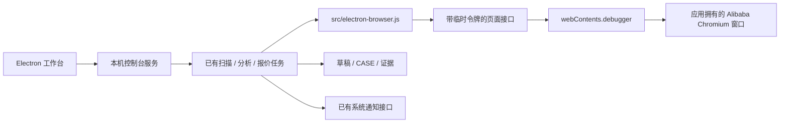

# 内置阿里巴巴浏览器

## 工作区菜单

- 数据集管理：真实 CASE 与原始报价证据。
- 报价 Agent：浏览器和账号状态、直接打开浏览器、扫描、报价模式与任务控制；运行环境细节折叠展示。
- 浏览器：窗口 / 当前页面 / 账号 / 独立会话 / 内核 / 任务占用状态，2 秒刷新；打开窗口、后退、前进、刷新、隐藏、打开 Alibaba 网址及导入 Chrome Alibaba 登录文件。
- 设置：模型服务、图片识别、报价与监控、数据导入及应用版本。配置沿用同一套加密保存接口，后续设置按分组扩展。

窗口打开后自动检查登录状态；「刷新状态」可以立即检查。浏览器操作默认可用，但不会自行启动任务。
界面每 2 秒更新，同页最多每 10 秒检查一次，失败也限频。任务占用或页面加载期间
只返回快照，不附着 CDP，不撤销任务 lease。导航后登录结果和限频缓存失效。
固定脚本只读取当前 RFQ 页面的可见文字，不接受前端传入脚本、不导航、不建立
任务 lease，不读取身份存储。登录页只提示手动登录。检测后断开 CDP，导航后
登录检测失效；任务仍使用原有授权和登录检查。任务或其他检测占用时拒绝手动导航。

当前为 Alibaba 专用单窗口浏览器，顶部显示当前标签、后退、前进、只读地址栏和「复制链接」。
前进/后退跟随内置 Chromium 的页面历史；无对应历史或任务占用时按钮禁用。
普通 Alibaba 页面可以复制 HTTPS 链接；登录页隐藏查询参数并禁用复制，避免把临时登录参数带出应用。
浏览器能登录、搜索、浏览网页和使用网站表单；暂未提供多标签、扩展安装、书签和下载管理界面。

## 用户流程

打开 RFQ 助手 → 配置模型 → 在报价 Agent 打开浏览器 → 手动登录 → 打开 RFQ 列表 → 自动显示账号状态 → 扫描或持续监控。

发现可报价草稿沿用机会通知和 CASE 审阅。回填与提交继续使用已有的单条
RFQ 确认、价格规则复核、字段回读、截图和提交成功状态落盘，不自动发送报价。
首次使用可手动登录，或由用户主动导出 Chrome 中的 Alibaba 登录文件后导入。
导入成功只代表 Cookie 写入完成，不能代替 RFQ 页面登录检查。

## 架构

- 主进程：`desktop/embedded-browser.js` 管理一个浏览器窗口；本地工具栏使用窗口自身页面，
  Alibaba 页面置于独立 `WebContentsView` 中。工具栏只接收过滤后的标题和链接，不接触网页 DOM 或登录存储。
- 会话：`persist:rfq-alibaba`，与工作台默认 session 分开，保存在操作系统
  应用数据目录。Chromium 持久化有过期时间的 Cookie 和站点存储；对重启
  即丢的 session Cookie，主进程使用本机 AES-GCM 加密文件备份本应用的
  Alibaba Cookie，并在首次导航前恢复；密钥文件和备份仅当前系统用户
  可读。网站注销会更新备份，退出时主动写盘。状态不包含 Cookie 值。
  浏览器任务不读取认证存储。
  用户主动导入通过 `desktop/browser-import.js` 和原生文件选择框写入此专用会话，
  失败回滚只读取应用自己的记录，不访问原 Chrome 的认证数据库。
- CDP：原生 `webContents.debugger.attach/sendCommand`，未设置
  `remote-debugging-port`。当前实现使用确定性 DOM 操作，不依赖 Chrome
  扩展的 `debugger`、`sidePanel` 或 MV3 service worker 兼容性。
- 工作进程：`src/browser.js` 根据 provider 路由；桌面强制 `electron-cdp`，
  失败直接报错，不能回退到用户 Chrome。Web/CLI 保留 `chrome-bridge`。
- 共用接口：`src/dom-locator.js`，采集、表单和图片流程沿用同一接口。
  填写、选择、点击标记为写操作，主进程再次检查报价授权。

## 接口与边界

| 入口 | 调用者 | 内容 |
|---|---|---|
| `POST /api/desktop/browser/open` | 同源工作台 | 显示窗口；可打开 HTTPS Alibaba 链接 |
| `GET /api/desktop/browser` | 本机工作台 | 窗口、页面、限频只读登录检查、操作建议；不返回登录 URL 参数 |
| `POST /api/desktop/browser/navigate` | 同源工作台 | navigate / back / forward / reload / hide；非 hide 操作要求空闲 |
| `POST /api/desktop/browser/inspect` | 同源工作台 | 固定脚本只读检测当前 RFQ 页面；不授予 Agent 权限 |
| `POST /api/desktop/browser/import` | 同源工作台 | 无参数；主进程原生文件选择、校验及导入；任务期间拒绝 |
| `GET /api/desktop/browser/export-tool` | 本机工作台 | 下载随包提供的 Alibaba 登录导出扩展 |
| `POST /api/desktop/browser/command` | 内置任务 | connect / release / state / goto / evaluate / screenshot |

任务入口严格要求启动时随机生成的 `X-RFQ-Browser` 令牌，仅经环境分发
给内置子任务，不返回前端、不写入连接文件、不接受控制台头替代，不授权其他
设置或通知路由。一次连接得到 lease；新连接、停止、关闭控制或退出撤销
旧 lease。请求串行执行，每次执行重新验证授权；停止后排队的写操作被拒绝。
已经发送给 Chromium 的单次操作无法撤销，提交被中断仍必须人工核对。

手动导航只允许 HTTPS `alibaba.com` 和其子域，以支持官方登录跳转。
自动导航/脚本/截图仅允许 `sourcing.alibaba.com`、`rfqposting.alibaba.com`。
禁止 file、外部站点、内嵌凭据、自定义端口；网页权限默认拒绝，Node 关闭、
sandbox 和 contextIsolation 开启。脚本/截图还检查预期 URL，手动切走
页面时立即失败；验证码、失去登录和连接异常使 watch 停止，保留证据。

关闭浏览器窗口只隐藏，轮询重用同一窗口且不反复抢焦点。菜单退出先撤销
控制，再停止任务和关闭自有窗口；电脑休眠时不承诺持续监听。

## 验证

`npm test` 覆盖来源检查、链接复制范围、令牌权限、页面范围、报价开关、lease 撤销和
原有价格、提交、通知规则。`npm run desktop:test:session` 用隔离的假
Alibaba Cookie 连续启动五次真实 Electron，验证原始丢失、加密恢复和
注销后不恢复。`npm run desktop:test:browser` 在真实 Electron
Chromium 上启动独立本地模拟站点，验证 DOM 读取、回填不提交、错误确认
拒绝、明确确认后的模拟成功、PNG 截图、报价权限关闭、标签地址复制和隐藏窗口复用。
本地测试白名单仅由测试入口注入，产品配置没有开放任意站点的开关。

本地模拟通过不等于真实 Alibaba 登录、验证码、页面改版或真实报价通过。
登录迁移在隔离会话使用人工构造的 Cookie 验证，不导出或导入用户真实身份数据。
Windows 安装、浏览器操作和通知仍需要 Windows 实机验证；macOS 系统通知
权限、Developer ID 签名和公证要求沿用桌面版说明。

官方依据：[Electron WebContentsView](https://www.electronjs.org/docs/latest/api/web-contents-view)、
[Electron CDP debugger](https://www.electronjs.org/docs/latest/api/debugger)、
[Electron 持久 session](https://www.electronjs.org/docs/latest/api/session)、
[Electron Cookie 生命周期](https://www.electronjs.org/docs/latest/api/cookies)。
