下面这张图按当前桌面版代码绘制。起点是「运行一轮分析」或「持续监控」；「只扫描 RFQ」只保存搜索结果，不进入模型分析和报价流程。

```mermaid
sequenceDiagram
    autonumber
    actor U as 用户
    participant UI as 桌面工作台
    participant C as 任务控制器
    participant W as 任务进程
    participant B as 内置 Chromium
    participant A as Alibaba RFQ
    participant M as OCR与需求模型
    participant R as 本地定价规则
    participant S as 本地记录
    participant N as 系统通知

    U->>UI: 选择品类、每轮新 RFQ 上限，点击运行
    UI->>C: 启动 once 或 watch
    C->>W: 启动任务，浏览器报价动作设为关闭
    W->>B: 连接应用内浏览器

    loop 每个选中的搜索词
        W->>B: 打开 RFQ 搜索页
        B->>A: 使用搜索词查询
        A-->>B: 返回 RFQ 列表
        B->>B: 检查登录和验证码状态
        B-->>W: 提取前 10 条有效卡片
    end

    alt 连接失败、未登录或出现验证码
        W-->>C: 中断本轮，记录具体错误
        C-->>UI: 提示用户在内置浏览器处理
    else RFQ 列表读取成功
        W->>S: 读取已处理 RFQ ID
        W->>W: 跨搜索词去重，排除已处理记录
        W->>W: 标题或摘要命中品类关键词
        W->>W: 按搜索结果顺序取本轮前 1 至 3 条

        alt 没有新候选
            W->>S: 保存本轮扫描结果
            W-->>C: 本轮完成，没有新分析记录
        else 找到新候选
            loop 对每条候选 RFQ
                W->>B: 打开买家 RFQ 详情页
                B->>A: 读取正文、数量、附件
                A-->>B: 返回原始需求
                B->>B: 再次检查登录与验证码
                B-->>W: 正文和可获取的图片

                opt 有可获取的图片
                    W->>M: 对图片执行 OCR
                    M-->>W: 图片文字或识别失败状态
                end

                W->>M: 提交标题、正文、数量和 OCR 文字
                alt 模型调用成功
                    M-->>W: 品类、规格、置信度、缺参、风险、建议
                else 模型调用失败
                    W->>W: 本地规则提取字段
                    W->>W: 标记需复核及模型失败风险
                end

                W->>R: 用提取规格和数量匹配价格规则
                alt 无规则、缺数量或规格不符
                    R-->>W: needs_review，没有可用金额
                    W->>W: 不生成买家报价回复
                else 命中条件价格
                    R-->>W: conditional_quote
                    W->>M: 生成附带条件的回复草稿
                    M-->>W: 草稿，失败时使用本地模板
                else 命中明确价格规则
                    R-->>W: quoted，返回单价与总价
                    W->>M: 按规则金额生成回复草稿
                    M-->>W: 草稿，失败时使用本地模板
                end

                W->>S: 保存原始 RFQ、图片、分析、价格和草稿
                W->>W: 桌面分析任务的自动联系模式为关闭
                W->>S: 记录 submission 为 skipped

                alt 明确报价且满足严格机会条件，并已开启通知
                    W->>N: 为这条新草稿发送一次通知
                    N-->>W: 已接受或发送失败
                else 不满足机会条件或通知已关闭
                    W->>W: 不发送系统通知
                end

                W->>S: 保存通知结果和阶段输入输出
            end
            W->>S: 更新已处理 RFQ ID，保存本轮汇总
            W-->>C: 返回扫描数、候选数和报价状态
        end
        C-->>UI: 展示阶段进度与结果
    end

    alt 持续监控仍在运行
        C-->>UI: 等待下一轮扫描
        U->>UI: 需要报价时先停止监控
        UI->>C: 停止当前任务，等待工作台空闲
    else 单轮任务已结束
        C-->>UI: 工作台空闲
    end

    UI->>C: 读取报价草稿列表
    C->>S: 查询本地草稿
    S-->>C: 返回记录与提交状态
    C-->>UI: 仅展示 quoted 且金额、算术和回复内容完整的草稿

    opt 用户选择一条明确报价草稿
        U->>UI: 查看原始需求、图片、分析、价格和拟回复
        U->>UI: 开启逐单浏览器报价模式
        UI->>C: 请求该草稿的实时报价预检
        C->>S: 读取草稿、文件哈希及历史动作
        C->>C: 检查模型建议、风险、额度和表单字段
        C-->>UI: 返回可回填、可提交及各自原因

        alt 不满足回填条件
            UI-->>U: 展示缺失项或风险，禁止浏览器回填
        else 满足回填条件
            U->>UI: 核对报价，勾选确认并输入完整 RFQ ID
            UI->>C: 请求回填，附草稿哈希和 RFQ ID
            C->>S: 重新读取草稿并复查条件

            alt 草稿变化、确认不符或任务繁忙
                C-->>UI: 拒绝回填，要求重新审阅
            else 复查通过
                C->>W: 启动单条回填任务
                W->>B: 打开该 RFQ 的 Alibaba 报价表单
                B->>A: 填商品、规格、交货地点、数量、单价、买家留言
                B->>B: 读回字段并保存表单截图

                alt 登录失效或表单回填失败
                    W-->>C: 返回错误
                    C-->>UI: 提示排查浏览器和表单
                else 回填及截图成功
                    W->>S: 保存 filled_not_submitted、字段值和截图
                    C-->>UI: 显示已回填，仍未向买家提交

                    alt 用户决定暂不提交
                        UI-->>U: 保留回填记录，等待后续核对
                    else 用户决定正式提交
                        U->>UI: 查看回填截图，再次核对并确认 RFQ ID
                        UI->>C: 请求提交，附最新草稿哈希
                        C->>S: 重新预检回填值、截图及提交条件

                        alt 截图缺失、字段变化或任一条件失败
                            C-->>UI: 拒绝提交，展示原因
                        else 提交条件全部通过
                            C->>W: 仅为这次确认开启提交权限
                            W->>S: 先记录 attempting，防止重复提交
                            W->>B: 重新打开报价页并填写相同字段
                            B->>A: 点击提交报价
                            A-->>B: 返回提交后的页面

                            alt 页面出现成功文案
                                B->>B: 保存提交后截图
                                W->>S: 持久化 submitted 和完成时间
                                C-->>UI: 显示已验证提交
                            else 报错或无法确认是否成功
                                W->>S: 持久化 needs_manual_review
                                C-->>UI: 提示人工核对 Alibaba 页面，避免盲目重试
                            end
                        end
                    end
                end
            end
        end
    end
```

**几个容易混淆的状态：**`quoted` 只表示命中了本地价格规则；`filled_not_submitted` 表示报价表单已回填并截图；只有点击提交后，页面出现成功文案、保存截图并将记录写成 `submitted`，工作台才显示“已提交”。当前模型的 `quote` 建议和置信度不会阻止定价函数产生 `quoted`，但会参与后续通知及浏览器操作预检。[扫描与保存](/Users/bytedance/Documents/Obsidian%20Vault/alibaba-rfq-agent/src/pipeline.js:13) · [报价预检](/Users/bytedance/Documents/Obsidian%20Vault/alibaba-rfq-agent/scripts/console-quote.mjs:30) · [表单提交与验证](/Users/bytedance/Documents/Obsidian%20Vault/alibaba-rfq-agent/src/form.js:15)